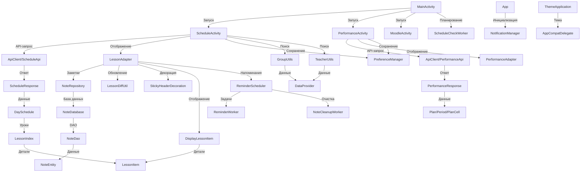

# Документация проекта ScheduleApp V5

## Обзор проекта

**IRKPO MENTOR** — это мобильное приложение для Android, разработанное для студентов и преподавателей, чтобы предоставить удобный доступ к расписанию занятий, данным об успеваемости, заметкам и интеграции с Moodle. Приложение поддерживает функциональность оффлайн, уведомления, темную тему и персонализированные настройки.

- **Цель**: Обеспечить интуитивный интерфейс для управления академическими данными.
- **Технологии**:
  - Язык программирования: Java
  - Платформа: Android (SDK, API 21+)
  - Библиотеки: Retrofit, Room, RecyclerView, WorkManager, SharedPreferences, Gson
  - UI: XML-лейауты, Material Design
- **Основные функции**:
  - Просмотр расписания с поддержкой сворачивания дней и заметок.
  - Отображение успеваемости с процентом посещаемости и оценками.
  - Создание и управление заметками с напоминаниями.
  - Интеграция с Moodle.
  - Уведомления об изменениях в расписании.
  - Поддержка темной темы.
- **Структура папок**:
  - `/java/com.example.sheduleapp_v5/`: Основные классы (`MainActivity.java`, etc.)
  - `/adapters`: Адаптеры (`LessonAdapter.java`, etc.)
  - `/db`: База данных Room (`NoteDatabase.java`, etc.)
  - `/models`: Модели данных (`DaySchedule.java`, etc.)
  - `/network`: Сетевые запросы (`ApiClient.java`, etc.)
  - `/utils`: Утилиты (`DataProvider.java`, etc.)
  - `/work`: WorkManager (`ReminderScheduler.java`, etc.)
  - `/res/layout/`: XML-лейауты
  - `/assets/`: JSON-файлы (`groups.json`, `teachers.json`)

---

## Описание файлов

### Основные классы

#### Файл: `MainActivity.java`

- **Тип**: Activity
- **Расположение**: `/java/com.example.sheduleapp_v5/MainActivity.java`
- **Функциональность**:
  - Главная точка входа приложения.
  - Навигация по основным экранам: расписание, успеваемость, Moodle.
  - Управление темной темой через `SharedPreferences`.
  - Планирование фоновой проверки расписания (`ScheduleCheckWorker`).
- **Зависимости**:
  - Входящие: `PreferenceManager`, `ScheduleCheckWorker`, `AppCompatDelegate`.
  - Исходящие: `ScheduleActivity`, `PerformanceActivity`, `MoodleActivity`.

#### Файл: `ScheduleActivity.java`

- **Тип**: Activity
- **Расположение**: `/java/com.example.sheduleapp_v5/ScheduleActivity.java`
- **Функциональность**:
  - Отображение расписания через `LessonAdapter` или `ScheduleAdapter`.
  - Запрос расписания через `ScheduleApi` по группе или преподавателю.
  - Автодополнение для выбора групп/преподавателей (`GroupUtils`, `TeacherUtils`).
  - Сохранение настроек через `PreferenceManager`.
- **Зависимости**:
  - Входящие: `ScheduleApi`, `GroupUtils`, `TeacherUtils`, `PreferenceManager`, `LessonAdapter`.
  - Исходящие: `ScheduleResponse`, `DisplayLessonItem`.

#### Файл: `PerformanceActivity.java`

- **Тип**: Activity
- **Расположение**: `/java/com.example.sheduleapp_v5/PerformanceActivity.java`
- **Функциональность**:
  - Отображение успеваемости через `PerformanceAdapter`.
  - Запрос данных через `PerformanceApi` по номеру телефона.
  - Сохранение номера телефона в `PreferenceManager`.
- **Зависимости**:
  - Входящие: `PerformanceApi`, `PreferenceManager`, `PerformanceAdapter`.
  - Исходящие: `PerformanceResponse`.

#### Файл: `MoodleActivity.java`

- **Тип**: Activity
- **Расположение**: `/java/com.example.sheduleapp_v5/MoodleActivity.java`
- **Функциональность**:
  - Интеграция с Moodle через WebView.
  - Авторизация и доступ к курсам.
- **Зависимости**:
  - Входящие: `WebView`, `PreferenceManager`.
  - Исходящие: Нет.

### Адаптеры

#### Файл: `LessonAdapter.java`

- **Тип**: RecyclerView Adapter
- **Расположение**: `/java/com.example.sheduleapp_v5/adapters/LessonAdapter.java`
- **Функциональность**:
  - Отображение расписания с заголовками дней и карточками уроков.
  - Поддержка сворачивания/разворачивания дней с анимацией.
  - Добавление/просмотр заметок через диалоги.
  - Планирование напоминаний через `ReminderScheduler`.
- **Зависимости**:
  - Входящие: `NoteRepository`, `DisplayLessonItem`, `LessonDiffUtil`, `ReminderScheduler`.
  - Исходящие: `DisplayLessonItem`, `LessonItem`.
- **Примечания**:
  - Использование `DiffUtil` оптимизирует обновления.

#### Файл: `PerformanceAdapter.java`

- **Тип**: RecyclerView Adapter
- **Расположение**: `/java/com.example.sheduleapp_v5/adapters/PerformanceAdapter.java`
- **Функциональность**:
  - Отображение данных об успеваемости (предмет, процент посещаемости, оценка).
  - Расчет процента посещаемости с учетом "НУ" и "Н".
  - Диалог с деталями уроков (дата, тема, оценка).
- **Зависимости**:
  - Входящие: `PerformanceResponse`, XML-лейауты.
  - Исходящие: Нет.
- **Примечания**:
  - Цветовое выделение оценок улучшает читаемость.

#### Файл: `ScheduleAdapter.java`

- **Тип**: RecyclerView Adapter
- **Расположение**: `/java/com.example.sheduleapp_v5/adapters/ScheduleAdapter.java`
- **Функциональность**:
  - Упрощенное отображение расписания (день, уроки).
  - Формирование текстовой информации об уроках.
- **Зависимости**:
  - Входящие: `DaySchedule`, `LessonIndex`, `LessonItem`.
  - Исходящие: Нет.
- **Примечания**:
  - Менее функционален, чем `LessonAdapter`.
  - Может использоваться в прототипах.

### База данных

#### Файл: `NoteDao.java`

- **Тип**: Room DAO
- **Расположение**: `/java/com.example.sheduleapp_v5/db/NoteDao.java`
- **Функциональность**:
  - Вставка, получение, удаление заметок в базе данных.
  - Методы: `insert`, `getNoteForLesson`, `getAllNotes`, `deleteByLessonKey`, `deleteAllNotes`.
- **Зависимости**:
  - Входящие: `NoteEntity`.
  - Исходящие: `NoteRepository`.
- **Примечания**:
  - Простой интерфейс для заметок.
  - `OnConflictStrategy.REPLACE` упрощает обновление.

#### Файл: `NoteDatabase.java`

- **Тип**: Room Database
- **Расположение**: `/java/com.example.sheduleapp_v5/db/NoteDatabase.java`
- **Функциональность**:
  - Определение базы данных для заметок.
  - Singleton-инстанс с доступом к `NoteDao`.
- **Зависимости**:
  - Входящие: `NoteEntity`, `NoteDao`.
  - Исходящие: `NoteRepository`.

#### Файл: `NoteEntity.java`

- **Тип**: Room Entity
- **Расположение**: `/java/com.example.sheduleapp_v5/db/NoteEntity.java`
- **Функциональность**:
  - Модель для таблицы заметок (`Id`, `lessonKey`, `text`, `createAt`, `remindAtMillis`).
  - Конструктор для создания заметки.
- **Зависимости**:
  - Входящие: Нет.
  - Исходящие: `NoteDao`, `NoteDatabase`.
- **Примечания**:
  - Простая структура.
  - Поле `createAt` полезно для отладки.

#### Файл: `NoteRepository.java`

- **Тип**: Репозиторий
- **Расположение**: `/java/com.example.sheduleapp_v5/db/NoteRepository.java`
- **Функциональность**:
  - Посредник между `LessonAdapter` и базой данных.
  - Методы: `saveNote`, `loadNote`, `deleteNote`, `getNoteEntity`.
- **Зависимости**:
  - Входящие: `NoteDao`, `NoteDatabase`.
  - Исходящие: `LessonAdapter`.
- **Примечания**:
  - Абстрагирует Room, упрощая доступ.

### Модели данных

#### Файл: `DaySchedule.java`

- **Тип**: Модель
- **Расположение**: `/java/com.example.sheduleapp_v5/models/DaySchedule.java`
- **Функциональность**:
  - Хранение данных о дне (день недели, тип недели, список уроков).
  - Геттеры для доступа.
- **Зависимости**:
  - Входящие: `LessonIndex`.
  - Исходящие: `ScheduleResponse`, `ScheduleAdapter`.
- **Примечания**:
  - Простая модель для API.

#### Файл: `DisplayLessonItem.java`

- **Тип**: Модель
- **Расположение**: `/java/com.example.sheduleapp_v5/models/DisplayLessonItem.java`
- **Функциональность**:
  - Представление UI-элементов (заголовок дня или урок).
  - Поля: тип, день, время, уроки, заметка, видимость.
- **Зависимости**:
  - Входящие: `LessonItem`.
  - Исходящие: `LessonAdapter`.
- **Примечания**:
  - Поддержка заметок и видимости делает модель гибкой.

#### Файл: `LessonIndex.java`

- **Тип**: Модель
- **Расположение**: `/java/com.example.sheduleapp_v5/models/LessonIndex.java`
- **Функциональность**:
  - Хранение временного слота урока (время начала/окончания, список уроков).
- **Зависимости**:
  - Входящие: `LessonItem`.
  - Исходящие: `DaySchedule`.
- **Примечания**:
  - Минималистичная модель для API.

#### Файл: `LessonItem.java`

- **Тип**: Модель
- **Расположение**: `/java/com.example.sheduleapp_v5/models/LessonItem.java`
- **Функциональность**:
  - Хранение данных об уроке (название, преподаватель, аудитория, комментарий, подгруппа, тип недели).
- **Зависимости**:
  - Входящие: Нет.
  - Исходящие: `LessonIndex`, `DisplayLessonItem`.
- **Примечания**:
  - Опциональные поля требуют проверки в UI.
  - `weekType` поддерживает фильтрацию.

#### Файл: `PerformanceResponse.java`

- **Тип**: Модель
- **Расположение**: `/java/com.example.sheduleapp_v5/models/PerformanceResponse.java`
- **Функциональность**:
  - Хранение ответа API об успеваемости (планы, семестры, предметы, оценки, уроки).
  - Вложенные классы: `Plan`, `Period`, `PlanCell`, `Attestation`, `Sheet`, `Lesson`.
- **Зависимости**:
  - Входящие: Нет.
  - Исходящие: `PerformanceApi`, `PerformanceAdapter`.
- **Примечания**:
  - Поддерживает сложные данные.

#### Файл: `ScheduleResponse.java`

- **Тип**: Модель
- **Расположение**: `/java/com.example.sheduleapp_v5/models/ScheduleResponse.java`
- **Функциональность**:
  - Хранение ответа API о расписании (дата, тип недели, список дней).
- **Зависимости**:
  - Входящие: `DaySchedule`.
  - Исходящие: `ScheduleApi`, `LessonAdapter`.
- **Примечания**:
  - Простая структура для расписания.
  - `currentWeekType` критичен для UI.

### Сетевые компоненты

#### Файл: `ApiClient.java`

- **Тип**: Сетевой клиент
- **Расположение**: `/java/com.example.sheduleapp_v5/network/ApiClient.java`
- **Функциональность**:
  - Инициализация Retrofit с базовым URL (`https://irkpo.ru/mtr/api/`).
  - Использование `GsonConverterFactory` для JSON.
- **Зависимости**:
  - Входящие: Retrofit, Gson.
  - Исходящие: `ScheduleApi`, `PerformanceApi`.
- **Примечания**:
  - Жесткий URL требует проверки.
  - Отсутствие таймаутов может быть проблемой.

#### Файл: `PerformanceApi.java`

- **Тип**: Retrofit API
- **Расположение**: `/java/com.example.sheduleapp_v5/network/PerformanceApi.java`
- **Функциональность**:
  - Эндпоинт `GET /student/{phoneNumber}` для успеваемости.
- **Зависимости**:
  - Входящие: `PerformanceResponse`.
  - Исходящие: `PerformanceActivity`.
- **Примечания**:
  - Зависит от формата номера телефона.

#### Файл: `ScheduleApi.java`

- **Тип**: Retrofit API
- **Расположение**: `/java/com.example.sheduleapp_v5/network/ScheduleApi.java`
- **Функциональность**:
  - Эндпоинты: `GET /schedule?GroupId={groupId}` и `GET /schedule?PersonId={personId}`.
- **Зависимости**:
  - Входящие: `ScheduleResponse`.
  - Исходящие: `ScheduleActivity`.
- **Примечания**:
  - Универсальный API для групп и преподавателей.
  - Единый эндпоинт упрощает интеграцию.

### Утилиты

#### Файл: `DataProvider.java`

- **Тип**: Утилита
- **Расположение**: `/java/com.example.sheduleapp_v5/utils/DataProvider.java`
- **Функциональность**:
  - Загрузка групп (`groups.json`) и преподавателей (`teachers.json`) из `assets`.
  - Парсинг JSON в `HashMap`.
- **Зависимости**:
  - Входящие: `JSONObject`, `AssetManager`.
  - Исходящие: `GroupUtils`, `TeacherUtils`.
- **Примечания**:
  - Логирование ошибок полезно.

#### Файл: `GroupUtils.java`

- **Тип**: Утилита
- **Расположение**: `/java/com.example.sheduleapp_v5/utils/GroupUtils.java`
- **Функциональность**:
  - Инициализация групп через `DataProvider`.
  - Фильтрация и сортировка групп по курсу и номеру.
- **Зависимости**:
  - Входящие: `DataProvider`.
  - Исходящие: `ScheduleActivity`.
- **Примечания**:
  - Сортировка улучшает UX.
  - Поиск без пробелов устойчив к форматам.

#### Файл: `LessonDiffUtil.java`

- **Тип**: Утилита
- **Расположение**: `/java/com.example.sheduleapp_v5/utils/LessonDiffUtil.java`
- **Функциональность**:
  - Оптимизация обновления `RecyclerView` через `DiffUtil`.
  - Сравнение `DisplayLessonItem` по типу, дню и времени.
- **Зависимости**:
  - Входящие: `DisplayLessonItem`.
  - Исходящие: `LessonAdapter`.
- **Примечания**:
  - Снижает нагрузку на UI.

#### Файл: `PreferenceManager.java`

- **Тип**: Утилита
- **Расположение**: `/java/com.example.sheduleapp_v5/utils/PreferenceManager.java`
- **Функциональность**:
  - Сохранение настроек: группа, номер телефона, ID группы.
- **Зависимости**:
  - Входящие: `SharedPreferences`.
  - Исходящие: `ScheduleActivity`, `PerformanceActivity`.
- **Примечания**:
  - Асинхронное сохранение (`apply`) эффективно.

#### Файл: `StickyHeaderDecoration.java`

- **Тип**: Утилита
- **Расположение**: `/java/com.example.sheduleapp_v5/utils/StickyHeaderDecoration.java`
- **Функциональность**:
  - Добавление липких заголовков дней в `RecyclerView`.
  - Динамическая отрисовка заголовка.
- **Зависимости**:
  - Входящие: `LessonAdapter`, `DisplayLessonItem`.
  - Исходящие: `ScheduleActivity`.
- **Примечания**:
  - Улучшает UX при прокрутке.

#### Файл: `TeacherUtils.java`

- **Тип**: Утилита
- **Расположение**: `/java/com.example.sheduleapp_v5/utils/TeacherUtils.java`
- **Функциональность**:
  - Инициализация преподавателей через `DataProvider`.
  - Фильтрация преподавателей по фамилии.
- **Зависимости**:
  - Входящие: `DataProvider`.
  - Исходящие: `ScheduleActivity`.

#### Файл: `ThemeApplication.java`

- **Тип**: Application
- **Расположение**: `/java/com.example.sheduleapp_v5/utils/ThemeApplication.java`
- **Функциональность**:
  - Настройка светлой/темной темы при запуске через `SharedPreferences`.
- **Зависимости**:
  - Входящие: `AppCompatDelegate`, `SharedPreferences`.
  - Исходящие: `MainActivity`.

### WorkManager

#### Файл: `NoteCleanupWorker.java`

- **Тип**: WorkManager Worker
- **Расположение**: `/java/com.example.sheduleapp_v5/work/NoteCleanupWorker.java`
- **Функциональность**:
  - Очистка всех заметок в базе данных.
  - Используется для еженедельной очистки.
- **Зависимости**:
  - Входящие: `NoteDatabase`.
  - Исходящие: `ReminderScheduler`.
- **Примечания**:
  - Простая реализация.

#### Файл: `ReminderScheduler.java`

- **Тип**: Утилита
- **Расположение**: `/java/com.example.sheduleapp_v5/work/ReminderScheduler.java`
- **Функциональность**:
  - Планирование напоминаний через `ReminderWorker`.
  - Планирование еженедельной очистки через `NoteCleanupWorker`.
  - Отмена напоминаний по ID.
- **Зависимости**:
  - Входящие: `WorkManager`, `ReminderWorker`, `NoteCleanupWorker`.
  - Исходящие: `LessonAdapter`.
- **Примечания**:
  - Гибкое управление задачами.

#### Файл: `ReminderWorker.java`

- **Тип**: WorkManager Worker
- **Расположение**: `/java/com.example.sheduleapp_v5/work/ReminderWorker.java`
- **Функциональность**:
  - Отправка уведомления о заметке.
  - Удаление заметки после уведомления.
- **Зависимости**:
  - Входящие: `NotificationCompat`, `NoteRepository`.
  - Исходящие: `ReminderScheduler`.
- **Примечания**:
  - Проверка разрешений на уведомления обязательна.
  - Требуется уникальный ID уведомления.

#### Файл: `ScheduleCheckWorker.java`

- **Тип**: WorkManager Worker
- **Расположение**: `/java/com.example.sheduleapp_v5/work/ScheduleCheckWorker.java`
- **Функциональность**:
  - Проверка изменений в расписании через `ScheduleApi`.
  - Сравнение старого и нового расписания через `SharedPreferences`.
  - Уведомление об изменениях.
- **Зависимости**:
  - Входящие: `ScheduleApi`, `PreferenceManager`, `Gson`.
  - Исходящие: `MainActivity`.
- **Примечания**:
  - Эффективное сравнение через JSON.

---

## Инструкции по установке и запуску

1. **Требования**:
   - Android Studio (последняя версия).
   - Android SDK (API 21+).
   - Устройство/эмулятор с Android 8.0+.
   - Зависимости: Retrofit, Room, RecyclerView, WorkManager, Gson.
   - Файлы: `groups.json`, `teachers.json` в `/assets/`.
2. **Установка**:
   ```bash
   git clone [репозиторий]
   mkdir app/src/main/assets
   cp groups.json teachers.json app/src/main/assets/
   ```
   - Открыть проект в Android Studio.
   - Синхронизировать `build.gradle`.
3. **Запуск**:
   ```bash
   Run > Run 'app'
   ```
4. **Конфигурация**:
   - Убедитесь, что в `AndroidManifest.xml` указан `ThemeApplication`:
     ```xml
     <application android:name=".utils.ThemeApplication" ...>
     ```
   - Проверьте разрешения: `POST_NOTIFICATIONS`.

---

## Тестирование

- **Тестовые сценарии**:
  - **UI**: Проверка сворачивания дней, добавления заметок (`LessonAdapter`).
  - **API**: Корректность ответов `ScheduleApi`, `PerformanceApi`.
  - **База данных**: Сохранение/удаление заметок (`NoteRepository`).
  - **WorkManager**: Уведомления (`ReminderWorker`), очистка (`NoteCleanupWorker`), проверка расписания (`ScheduleCheckWorker`).
  - **Утилиты**: Фильтрация групп/преподавателей (`GroupUtils`, `TeacherUtils`), липкие заголовки (`StickyHeaderDecoration`).
  - **Тема**: Переключение светлой/темной темы (`ThemeApplication`).
- **Инструменты тестирования**:
  - JUnit, Espresso для UI-тестов.
  - MockWebServer для API.
  - Logcat для отладки WorkManager.
- **Как запустить тесты**:
  ```bash
  Run > Run 'All Tests'
  ```
- **Рекомендации**:
  - Добавить тесты для обработки `null` в моделях.
  - Проверить производительность `StickyHeaderDecoration` на больших списках.

---

## Взаимодействие компонентов



- **Описание потока**:
  - `ThemeApplication` настраивает тему при запуске.
  - `MainActivity` инициирует навигацию и планирует `ScheduleCheckWorker`.
  - `ScheduleActivity` запрашивает расписание через `ScheduleApi`, использует `GroupUtils` и `TeacherUtils` для поиска, отображает данные через `LessonAdapter`.
  - `PerformanceActivity` запрашивает успеваемость через `PerformanceApi`, отображает через `PerformanceAdapter`.
  - `LessonAdapter` управляет заметками через `NoteRepository`, планирует напоминания через `ReminderScheduler`.
  - `ReminderScheduler` запускает `ReminderWorker` для уведомлений и `NoteCleanupWorker` для очистки.
  - `PreferenceManager` сохраняет настройки.
  - `StickyHeaderDecoration` и `LessonDiffUtil` оптимизируют UI.

---

## Приложения

### Глоссарий

- **Room**: ORM-библиотека для SQLite.
- **Retrofit**: Клиент для HTTP-запросов.
- **WorkManager**: Планировщик фоновых задач.
- **SharedPreferences**: Хранение ключ-значение.
- **RecyclerView**: Компонент для списков.
- **Gson**: Библиотека для JSON-десериализации.
- **AssetManager**: Доступ к файлам в `/assets/`.

### Дополнительные ресурсы

- [Android Developer Guide](https://developer.android.com/guide)
- [Room Documentation](https://developer.android.com/training/data-storage/room)
- [Retrofit Documentation](https://square.github.io/retrofit/)
- [WorkManager Guide](https://developer.android.com/topic/libraries/architecture/workmanager)
- [Gson Documentation](https://github.com/google/gson)

### Пример JSON для assets

- **groups.json**:
  ```json
  {
  	"И-322": 123
  }
  ```
- **teachers.json**:
  ```json
  {
  	"Иванов Иван Иванович.": "gf5cc3fb-e581-420f-be66-b833244451de"
  }
  ```

---

## Заключение

**ScheduleApp V5** предоставляет мощный инструмент для управления академическими данными, с поддержкой расписания, успеваемости, заметок и интеграции с Moodle. Приложение использует современные Android-технологии, обеспечивая гибкость и удобство.
