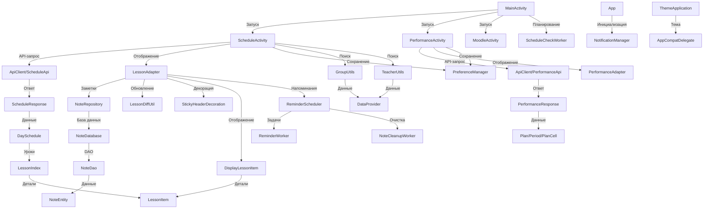

## Обзор

**Stud-Informer** — мобильное приложение для Android, разработанное для студентов и преподавателей Иркутского регионального колледжа педагогического образования ([ИРКПО](https://irkpo.ru/www/)). Оно предоставляет удобный доступ к расписанию занятий, данным об успеваемости, заметкам, интеграции с Moodle, а также поддерживает уведомления и тёмную тему.

- **Цель**: Упростить управление учебным процессом через интуитивный интерфейс.
- **Основные функции**:
  - Просмотр расписания с сворачиваемыми днями и заметками.
  - Отслеживание успеваемости (оценки, посещаемость).
  - Создание и управление заметками с напоминаниями.
  - Интеграция с Moodle через WebView.
  - Push-уведомления об изменениях расписания.
  - Поддержка светлой/тёмной темы.
- **Платформа**: Android 8.0+ (API 26+).
- **Язык**: Java.

## Технологии

- **Фреймворки и библиотеки**:
  - Retrofit: HTTP-запросы к API.
  - Room: Локальная база данных для заметок.
  - RecyclerView: Отображение списков.
  - WorkManager: Фоновые задачи и уведомления.
  - Material Components: Современный UI.
  - Gson: Парсинг JSON.
- **Инструменты**:
  - Android Studio, Gradle.
  - JUnit, Espresso для тестирования.
- **Ресурсы**:
  - JSON-файлы (`groups.json`, `teachers.json`) для групп и преподавателей.
  - API: `https://irkpo.ru/mtr/api/` для расписания и успеваемости.

## Установка и запуск

### Требования
- Android Studio (последняя версия).
- Android SDK (API 26+).
- Устройство или эмулятор с Android 8.0+.
- Файлы `groups.json` и `teachers.json` в `/app/src/main/assets/`.

### Установка
1. Клонируйте репозиторий:
   ```bash
   git clone https://github.com/Ximelay/android-scheduleApp.git
   ```
2. Скопируйте JSON-файлы:
   ```bash
   mkdir app/src/main/assets
   cp groups.json teachers.json app/src/main/assets/
   ```
3. Откройте проект в Android Studio и синхронизируйте `build.gradle`.

### Запуск
1. Подключите устройство или запустите эмулятор.
2. Выполните:
   ```bash
   Run > Run 'app'
   ```
3. Убедитесь, что в `AndroidManifest.xml` указан:
   ```xml
   <application android:name=".utils.ThemeApplication" ...>
   ```
4. Проверьте разрешение `POST_NOTIFICATIONS`.

## Структура проекта

- **Основные модули**:
  - `/java/com.example.sheduleapp_v5/`: Activity (`MainActivity`, `ScheduleActivity`, `PerformanceActivity`, `MoodleActivity`).
  - `/adapters/`: Адаптеры для RecyclerView (`LessonAdapter`, `PerformanceAdapter`).
  - `/db/`: Room для заметок (`NoteDatabase`, `NoteDao`, `NoteEntity`, `NoteRepository`).
  - `/models/`: Модели данных (`DaySchedule`, `DisplayLessonItem`, `PerformanceResponse`).
  - `/network/`: Сетевые запросы (`ApiClient`, `ScheduleApi`, `PerformanceApi`).
  - `/utils/`: Утилиты (`GroupUtils`, `PreferenceManager`, `StickyHeaderDecoration`).
  - `/work/`: WorkManager (`ScheduleCheckWorker`, `ReminderWorker`).
- **Ресурсы**:
  - `/res/layout/`: XML-лейауты интерфейса.
  - `/assets/`: JSON-файлы (`groups.json`, `teachers.json`).

## Основные компоненты

- **MainActivity**: Точка входа, навигация, настройка темы, запуск фоновых задач.
- **ScheduleActivity**: Отображение расписания, выбор группы/преподавателя, заметки.
- **PerformanceActivity**: Просмотр успеваемости по номеру телефона.
- **MoodleActivity**: Доступ к Moodle через WebView.
- **LessonAdapter**: RecyclerView для расписания с анимацией и заметками.
- **NoteRepository**: Управление заметками через Room.
- **ScheduleCheckWorker**: Фоновая проверка изменений расписания.

## Тестирование

- **Сценарии**:
  - UI: Навигация, отображение расписания, добавление заметок.
  - API: Корректность ответов `/schedule` и `/student`.
  - База данных: Сохранение/удаление заметок.
  - Уведомления: Push-уведомления и очистка заметок.
  - Тема: Переключение светлой/тёмной темы.
- **Инструменты**:
  - JUnit для юнит-тестов.
  - Espresso для UI-тестов.
  - MockWebServer для API.
- **Запуск тестов**:
  ```bash
  Run > Run 'All Tests'
  ```

## Взаимодействие компонентов



- **Поток данных**:
  - `MainActivity` запускает навигацию и фоновую проверку (`ScheduleCheckWorker`).
  - `ScheduleActivity` запрашивает данные через `ScheduleApi`, отображает через `LessonAdapter`.
  - `LessonAdapter` управляет заметками (`NoteRepository`) и напоминаниями (`ReminderScheduler`).
  - `PerformanceActivity` получает успеваемость через `PerformanceApi`.
  - `GroupUtils` и `TeacherUtils` загружают данные из JSON (`DataProvider`).


## Лицензия

Проект распространяется под лицензией [BSD 3-Clause](https://github.com/Ximelay/android-scheduleApp/blob/main/LICENSE).

## Контакты

- Автор: [Ximelay](https://github.com/Ximelay)
- Вопросы: Открывайте [issue](https://github.com/Ximelay/android-scheduleApp/issues) или пишите в обсуждения.